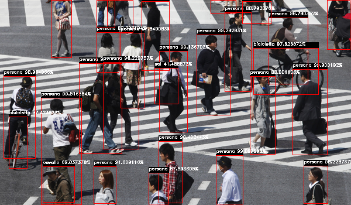
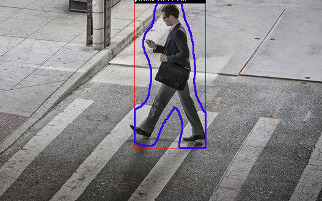
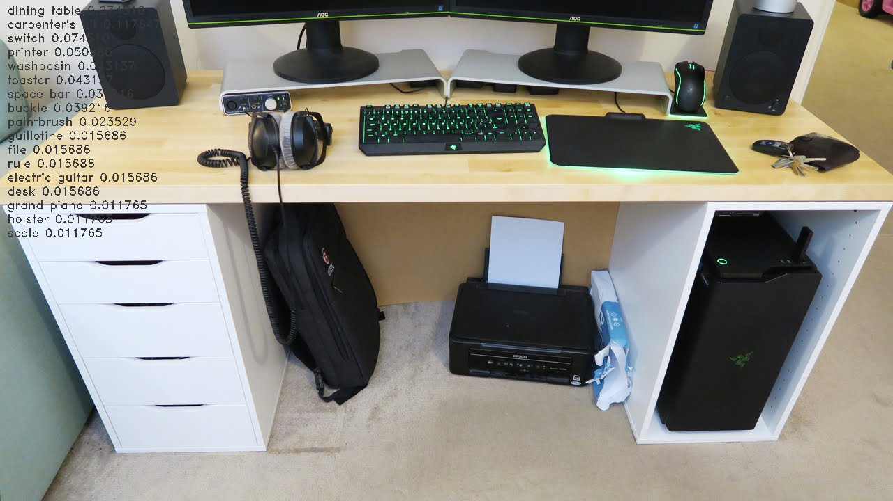
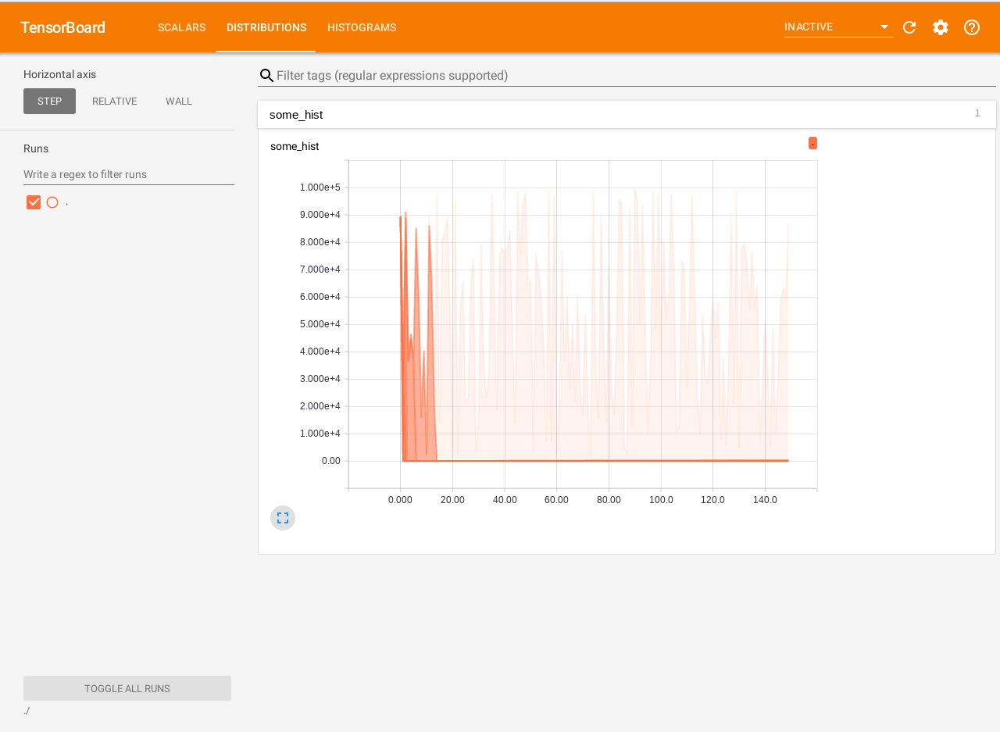

# tf_inference

Experiments Tensorflow inference

inference tensorflow object-detection: 

inference tensorflow object-detection semantic segmentation(mask-rcnn): 

inference tensorflow lite classify: 

sample tensorflow events tensorboard (histogram): 

